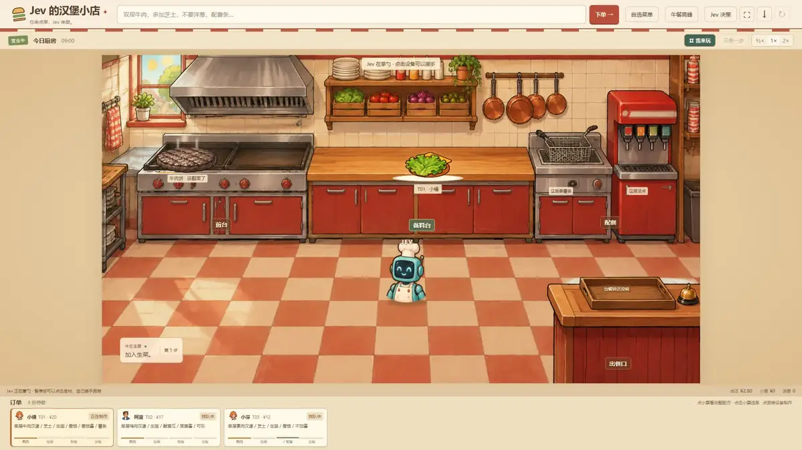

# Jev Burger Rush｜Jev 汉堡高峰

[](https://lcgf.xyz/jev-burger/media/lunch-rush.mp4)

点击上方画面播放[完整、未剪辑的午餐高峰录屏](https://lcgf.xyz/jev-burger/media/lunch-rush.mp4)。视频由网站单独提供，不放进 Git 源码。也可以[直接打开游戏](https://lcgf.xyz/jev-burger/)。

这是一个原创的汉堡店模拟经营游戏。你可以用中文描述想吃的汉堡、从菜单点单，自己操作厨房，或者把厨房交给 Jev。三张小票一起进来时，Jev 会根据当前订单、食材、火候和配餐状态，一次选择一个当前可执行的动作；每做一步，厨房状态都会变化。游戏独立核对出餐与小票是否一致，并给出评分。

录屏对应 **2026-10-08 的一次实测**：三份订单各得 100 分，39 次 Jev 厨房决策平均用时 297.8 ms，手动烹饪操作 0 次。这只是这次录制的结果，不代表每次运行都能得到相同分数或速度。

<details>
<summary>jev商业定制、技术场景交流欢迎联系，请注明来意。</summary>


</details>

## 怎么玩

- **点单**：用中文写出配方，或者在菜单中选择肉饼、配料、酱料和配餐；“午餐高峰”会加入三位顾客的不同订单。中文点单由 Jev 识别，菜单点单和高峰订单直接使用选好的配方。
- **自己做**：点击小票、煎台、备料台、配餐区和出餐口，按当前厨房状态完成订单。
- **交给 Jev**：Jev 每次只从当前合法动作中选择一步，下一步再读取更新后的厨房状态。可以暂停、单步查看，也能随时接手。
- **查看结果**：打开“Jev 决策”查看实际输入、候选动作和模型返回，导出完整记录；订单配料、配餐和评分由游戏规则单独核对。概率不等于出餐正确率。

手动玩不需要 API key。让 Jev 识别中文点单或自动掌勺时，需要在页面中填入自己的 TypeSafe 官方 API key。密钥通过 HTTPS 提交到 `/api/key`，服务端仅在内存中按当前会话保存 2 小时；会话由 HttpOnly cookie 绑定，提交后前端清空输入框。点“清除密钥”可立即清除。密钥不会返回给浏览器，也不会写入日志或仓库。使用官方模型可能产生 API 用量。

## 本地运行

需要 Node.js **22.12 或更新版本**。安装依赖后构建并启动：

```bash
npm install
npm run build
npm start
```

默认打开 [http://127.0.0.1:5193/](http://127.0.0.1:5193/)。服务只监听 `127.0.0.1`。开发时可运行 `npm run dev`；规则测试运行 `npm test`。

## 部署在 `/jev-burger/`

下面以服务器上的 `5023` 端口为例。设置前缀并重新构建，随后启动 Node 服务：

```bash
npm install
BURGER_PORT=5023 VITE_BASE_PATH=/jev-burger/ npm run build
BURGER_PORT=5023 BURGER_MEDIA_DIR=/home/hxy/apps/jev-burger-rush/media npm start
```

网站入口需使用 HTTPS，反向代理可以这样配置：

```nginx
location = /jev-burger {
    return 301 /jev-burger/;
}

location ^~ /jev-burger/ {
    proxy_pass http://127.0.0.1:5023/;
    proxy_set_header Host $host;
    proxy_set_header X-Forwarded-Proto $scheme;
}
```

将完整录屏单独放在服务器的 `/home/hxy/apps/jev-burger-rush/media/lunch-rush.mp4`；这一路径只是部署示例，可以按实际服务器目录调整；让 BURGER_MEDIA_DIR 指向该文件所在目录，服务支持视频分段读取和拖动播放。视频文件不提交到 Git。访问 `/jev-burger/media/lunch-rush.mp4` 应能播放录屏，`/jev-burger/` 应能打开游戏。

## 项目范围

游戏使用固定菜单、模拟火候与等待时间、虚拟营业额和评价。它是独立创作的汉堡店模拟经营作品，不使用“老爹”系列的官方角色、商标或原始素材。代码采用 [MIT License](LICENSE)。

jev商业定制、技术场景交流欢迎联系，请注明来意。


